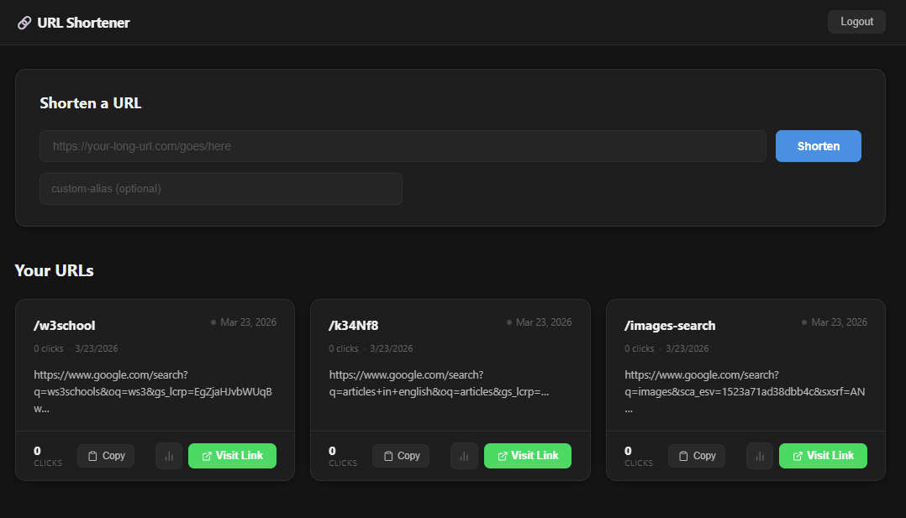

# URL Shortener

A production-grade, full-stack URL shortening service built with Node.js, Express, PostgreSQL, and React.



## 🚀 Features

- **JWT Authentication** — Secure register/login; all write operations are protected
- **Google Sign-In** — One-click login via Google; accounts linked automatically by email
- **URL Shortening** — Convert any long URL into a short, shareable link
- **Custom Aliases** — Choose your own slug (e.g. `/my-portfolio`) instead of a random code
- **Click Analytics** — Per-link total clicks, last-accessed timestamp, and daily click breakdown (last 30 days)
- **IP & User-Agent Tracking** — Every redirect records visitor IP and browser info
- **Copy to Clipboard** — One-click copy on every URL card in the dashboard
- **Rate Limiting** — 100 req/15 min globally; 10 req/15 min on auth routes
- **Input Validation & SSRF Protection** — URLs are validated for protocol and blocked against private/loopback IP ranges
- **Proper Error Handling** — Global error handler; consistent HTTP status codes throughout
- **User-Specific URLs** — Each user sees only their own links
- **Protected Routes** — Frontend and backend both enforce authentication

---

## 🏗 Architecture

```
┌────────────────────────────────────────────────────────┐
│                     React Frontend                     │
│  Login / Register / Dashboard (Vite + React Router)    │
└──────────────────────┬─────────────────────────────────┘
                       │ HTTP (Axios + JWT Bearer token)
┌──────────────────────▼─────────────────────────────────┐
│                 Express Backend                        │
│                                                        │
│                Middleware stack:                       │
│      helmet → cors → rate-limit → json → routes        │
│                                                        │
│                    Routes                              │
│    /auth          → authRoutes → authController        │
│    /shorten       → urlRoutes  → urlController         │
│    /links         → urlRoutes  → urlController         │
│    /analytics/:c  → urlRoutes  → urlController         │
│    /:shortCode    → urlRoutes  → redirect              │
│                                                        │
│       Services → Models → PostgreSQL (pg Pool)         │
└──────────────────────┬─────────────────────────────────┘
                       │
┌──────────────────────▼─────────────────────────────────┐
│                    PostgreSQL                          │
│            users | urls | url_clicks                   │
└────────────────────────────────────────────────────────┘
```

---

## 🛠 Tech Stack

| Layer | Technology |
|-------|-----------|
| Runtime | Node.js |
| Framework | Express.js |
| Database | PostgreSQL |
| Auth | JWT + bcryptjs + Google OpenID Connect |
| Security | helmet, express-rate-limit, google-auth-library |
| ORM/Client | pg (node-postgres) |
| Frontend | React 19 + React Router 7 |
| HTTP client | Axios |
| Styling | SCSS |
| Build tool | Vite |
| Testing | Jest, Supertest, React Testing Library |

---

## 🔐 Security

- **Rate limiting** — 100 req/15 min globally; stricter 10 req/15 min on `/auth/*` to slow credential-stuffing
- **Input validation** — URLs must use `http`/`https`; hostnames are checked against private IPv4 ranges to prevent SSRF (loopback, RFC-1918, link-local)
- **Google Sign-In** — ID token is cryptographically verified server-side via `google-auth-library`; Google tokens are never stored
- **Secure headers** — `helmet` sets CSP, HSTS, X-Frame-Options, and more on every response
- **Passwords** — hashed with bcrypt

---

## 🔢 Short Code Generation

Random codes are generated in `backend/utils/shortCodeGenerator.js` using **Base62 encoding** over cryptographically random bytes:

```
Alphabet: 0-9 a-z A-Z  (62 characters)
Length:   6 characters
Space:    62^6 = ~56.8 billion unique codes
```

**Why Base62?**
- URL-safe: no special characters, no encoding needed
- Compact: 6 characters is short enough to fit in a tweet, SMS, or QR code
- Large enough: 56 billion codes covers hundreds of millions of URLs with negligible collision probability

**Collision handling:**
`generateUniqueShortCode()` queries `existsShortCode()` after each generation and retries up to 10 times before throwing.

**Custom aliases** skip random generation entirely and are validated client-side and server-side with `/^[a-zA-Z0-9_-]{3,50}$/`.

---

## 📖 API Documentation

All endpoints return JSON. Authenticated endpoints require `Authorization: Bearer <token>`.

### Authentication

#### `POST /auth/register`
Register a new user.

**Body:**
```json
{ "email": "user@example.com", "password": "yourpassword" }
```
**Response `201`:**
```json
{ "id": 1, "email": "user@example.com" }
```

#### `POST /auth/login`
Login and receive a JWT token.

**Body:**
```json
{ "email": "user@example.com", "password": "yourpassword" }
```
**Response `200`:**
```json
{ "token": "<jwt>", "user": { "id": 1, "email": "user@example.com" } }
```

#### `POST /auth/google`
Sign in (or register) with a Google ID token.

**Body:**
```json
{ "credential": "<google_id_token>" }
```
**Response `200`:**
```json
{ "token": "<jwt>", "user": { "id": 1, "email": "user@google.com" } }
```

---

### URL Management

#### `POST /shorten` 🔒
Create a shortened URL. Optionally provide a custom alias.

**Body:**
```json
{
  "longUrl": "https://example.com/long/url",
  "customAlias": "my-link"
}
```
`customAlias` is optional. Must be 3–50 characters: letters, numbers, hyphens, underscores.

**Response `201`:**
```json
{
  "id": 1,
  "long_url": "https://example.com/long/url",
  "short_code": "my-link",
  "clicks": 0,
  "created_at": "2026-03-23T10:00:00.000Z"
}
```

#### `GET /links` 🔒
Get all shortened URLs belonging to the authenticated user.

**Response `200`:**
```json
{
  "urls": [
    { "id": 1, "long_url": "...", "short_code": "my-link", "clicks": 5, "created_at": "..." }
  ]
}
```

#### `GET /:shortCode`
Redirect to the original URL (increments click counter, records IP + user-agent).

**Response:** `302 Found` → original URL
**Response `404`** if short code doesn't exist.

#### `GET /analytics/:shortCode` 🔒
Get click analytics for a specific short URL.

**Response `200`:**
```json
{
  "totalClicks": 25,
  "lastAccessed": "2026-03-22T10:00:00.000Z",
  "dailyClicks": [
    { "date": "2026-03-22", "count": 10 },
    { "date": "2026-03-21", "count": 15 }
  ]
}
```

---

## 🧪 Testing

Tests are written with **Jest** (backend) and **React Testing Library** (frontend). Backend integration tests use **Supertest** and run against a real PostgreSQL database.

### Coverage

| Area | Tests |
|------|-------|
| Auth — register, login, duplicate email, bad password, missing fields | ✅ |
| URL — shorten, custom alias, duplicate alias, invalid alias, list, redirect, 404 | ✅ |
| Analytics — success response, 404 for unknown code | ✅ |
| Auth middleware — 401 on missing/invalid token | ✅ |
| Frontend — Login, Register, Dashboard, PrivateRoute components | ✅ |


---

## 📈 Scalability Considerations

This project is built with scale in mind:

**Horizontal scaling**
- The Express server is stateless (auth via JWT, no server-side sessions), so multiple instances can run behind a load balancer without sticky sessions.

**Database**
- The `url_clicks` table is append-only — write-heavy but trivially shardable by `short_code`.
- Click counts are stored redundantly on `urls.clicks` (fast single-field read) and in detail on `url_clicks` (accurate analytics). This trades a bit of storage for O(1) click-count reads.
- Indexes on `short_code` (already UNIQUE, so indexed) make `GET /:shortCode` fast even at millions of rows.

**Caching (next step)**
- The redirect path (`GET /:shortCode`) is the hottest endpoint. A Redis layer in front of the DB lookup would cut latency from ~5 ms to <1 ms and reduce DB load by 99%+ for popular links.

**Rate limiting**
- `express-rate-limit` with an in-memory store works for a single server. For multi-instance deployments, swap the store for `rate-limit-redis` to share counters across instances.

**Short code collisions**
- The base-62 generator produces 56 billion unique 6-character codes — enough for hundreds of millions of URLs before the retry logic becomes a concern.

**Analytics aggregation**
- For very high traffic, pre-aggregate `url_clicks` into hourly/daily summary tables via a background job (e.g. pg_cron) rather than querying raw rows on every analytics request.
